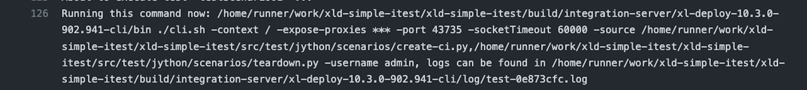

### Requirements

Documentation is applicable for a version **10.3.0-902.1243** or later.

The version of the plugin contains not random values, but you can read it next way
10.3.0 means that it works for Deploy 10.3.0

After the dash is the information about the time when it was released: <br/>
902 - 2nd of September <br/>
1020 - 10:20 AM <br/>

### Introduction

I expect that you are the beginner of using this plugin, and your intention is to create your first integration test
for your custom plugin in against running Deploy instance. 

At this moment you can run only Jython based tests which are executed via CLI.

```groovy
integrationServer {
    clis {
        cli {
            version = "10.3.0-902.1430"
        }
    }
    servers {
        controlPlane {
            dockerImage = "xebialabs/xl-deploy"
            version = "10.2.2"
        }
    }
    tests {
        testScenario01 {
            baseDirectory = file("src/test/jython/scenarios")
            extraClassPath = [file("src/test/jython/py-classpath")]
            tearDownScripts = ['teardown.py']
        }
    }
}
```

In CLI section we specify the version which is available publicly. It can mismatch with Deploy server. 
Most of the time it is backward compatible. Specially for the usage of it inside of integration server CLI was changed,
therefore you can't use CLI with a lower version than `10.3.0-902.1430`. 

### Test section explanation

In tests section, you can create multiple test sections. At this blog we will take a look at the simplest configuration required.
First of all, you have to define where are your all tests resides, what is the base directory of it.

```groovy
baseDirectory = file("src/test/jython/scenarios")
```
This is exactly what we do here. Then you can create sub-folders and keep each scenario in own folder.

CLI is a java process which has own classpath and can contain inside the python modules so that you can have access to them from your tests.
Quite useful to keep there the shared utils. For example, it can be assertion tools or variables (like in teardown script to know what to scrape out).
For that you can add extra folders to a default classpath strategy of CLI by

```groovy
extraClassPath = [file("src/test/jython/py-classpath")]
```

:::info

Default strategy to compose a classpath for CLI can be found in `cli.(sh|cmd)` script. Namely, these lines (for *.sh):

```shell script
for each in `ls hotfix/*.jar lib/*.jar plugins/*.jar 2>/dev/null`
do
  if [ -f $each ]; then
    DEPLOYIT_CLI_CLASSPATH=${DEPLOYIT_CLI_CLASSPATH}:${each}
  fi
done
``` 

So it means that you can also leverage from creating your own python module, archive it as `jar` and use `overlays` to 
place it in CLI as a `plugin` or a `lib`. You can take it as an alternative whenever you have to reuse same logic across
multiple repositories. 

:::

When test has finished, successfully or not, it is a good practice to clean up everything what test created. 
This configuration is exactly for this purpose:

```groovy
tearDownScripts = ['teardown.py']
```

Full set of options for this section you can find here: 
[https://xebialabs.github.io/integration-server-gradle-plugin/docs/getting-started/configuration#tests-section](https://xebialabs.github.io/integration-server-gradle-plugin/docs/getting-started/configuration#tests-section) 

For a full version of this configuration file (and the project), have look at an example:
 [https://github.com/acierto/xld-simple-itest](https://github.com/acierto/xld-simple-itest)
 

## Under the hood
 
Great, we set it up. Let's figure out how it works.

### Downloading flow

We download a server and CLI to a build folder. As you can see it on the picture: 


As we didn't apply any modification sections as `overlays`, `copyBuildArtifacts`, etc. the structure and content there 
would be same as from Nexus/Docker image.

### Test execution and troubleshooting

Test runner is looking at the configurations, searching for a base folder to scan there files and then creates a sequence of them to execute.
As we have only 1 test and 1 teardown script we will see as a source for CLI 2 tests. I'll refer to the available logs produced
by GitHub Actions [https://github.com/acierto/xld-simple-itest/runs/3495662609](https://github.com/acierto/xld-simple-itest/runs/3495662609).

There we can find the next log snippet: 
  
What is interesting to see here for us: <br/>

* To pay attention to that we connect to a non-default port `-port 43735`. In a server section we didn't specify
the fixed port, so we are running it on a random. It's very important if you want to run several tests in parallel and to not clash
by using the same port. CLI picks that information by reading in the file `conf/deployit.conf` a property value for a key `http.port`.

* As we didn't define a socket port, it is running with a timeout of 1 minute: `-socketTimeout 60000`. If you'll have some long-running scripts which 
will take longer than that, this is a place to tune it. 

* As order of Python test execution matters, you can check it out in an option `-source`. In this example we can see the next:
```shell script
-source /home/runner/work/xld-simple-itest/xld-simple-itest/src/test/jython/scenarios/create-ci.py,/home/runner/work/xld-simple-itest/xld-simple-itest/src/test/jython/scenarios/teardown.py
```

* All the logs related to a CLI execution will be saved in `<CLI_HOME>/log` and exact location for this log is also specified, for a convenience of troubleshooting:
 `/home/runner/work/xld-simple-itest/xld-simple-itest/build/integration-server/xl-deploy-10.3.0-902.941-cli/log/test-0e873cfc.log`.
 After each re-run we remove old logs to not be buried under multiple versions of it. Be aware to copy it to another location if you'd like to preserve it.
