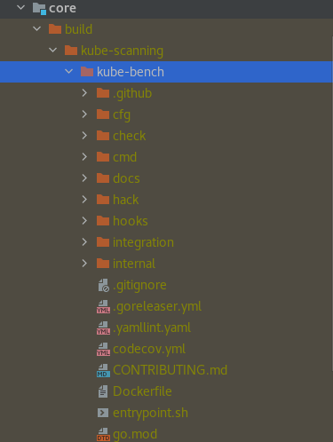
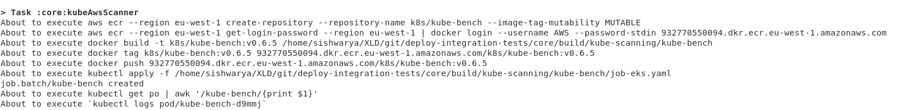
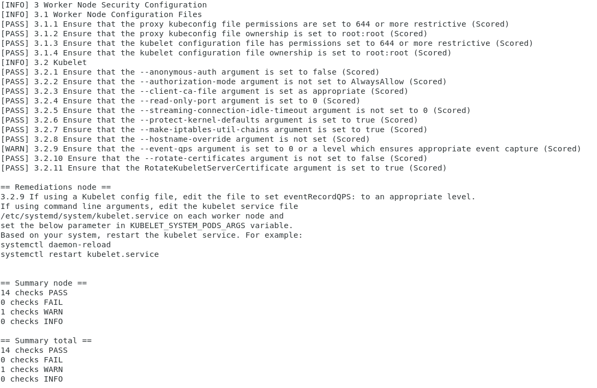

### Introduction

Create your Kube Scanner integration test, for your custom plugin by running k8s cluster.
Here we are using the [Kube-bench](https://github.com/aquasecurity/kube-bench/tree/0d1bd2bbd95608957be024c12d03a0510325e5e2) tool that checks the Kubernetes cluster is deployed securely by running the necessary checks documented in the CIS Kubernetes Benchmark.


### Build gradle configuration for kube scanner

```groovy
deployIntegrationServer {
    kubeScanner {
        awsRegion = 'eu-west-1' 
        logOutput = true
        kubeBenchTagVersion = "v0.6.5"
        command = ["-v", "3", "logtostrerr"]
    } 
}
```
|Name|Type|Default Value|Description|
| :---: | :---: | :---: | :---: |
|awsRegion|Optional| |By default it will read from config [~/.aws/config] file.|
|logOutput|Optional|false| To Log the command and output executed while running the integration test.
|kubeBenchTagVersion|Optional|latest|By default it will use the latest main branch. | 
|command|Optional|["kube-bench", "run", "--targets", "node","--benchmark", "eks-1.0"]| List of [command](https://github.com/aquasecurity/kube-bench/blob/main/docs/flags-and-commands.md) for running the test.


## Under the hood
 
Great, we now have the setup done. Let's figure out how it works.
### How to scan the kubernetes cluster which is running on AWS (EKS)?

* By Running the below command, we can scan the Kubernetes cluster which is configured as current-context in ~/.kube/config. 
```shell script
./gradlew clean kubeScanning
```

* Firstly, it will clone the kube-bench repo with a tag to build/kube-scanning/kube-bench folder. As in the below illustration: 



* Next, execute the steps for [AWS-EKS-Cluster](https://github.com/aquasecurity/kube-bench/blob/main/docs/running.md#running-in-an-eks-cluster)
    * Create the repository in AWS ECR 
    * Take docker build of kube-bench with tag
    * Push the created image to AWS ECR
    * We will update the job-eks.yaml with the latest image which we generate in a previous step and run the job.


    
:::info
    job-eks.yaml job runs on the worker node EKS cluster.


* Once the above command execution is completed, we can find the report in build/kube-scanning/report/aws-eks.log, like the below sample log.
 
 
 