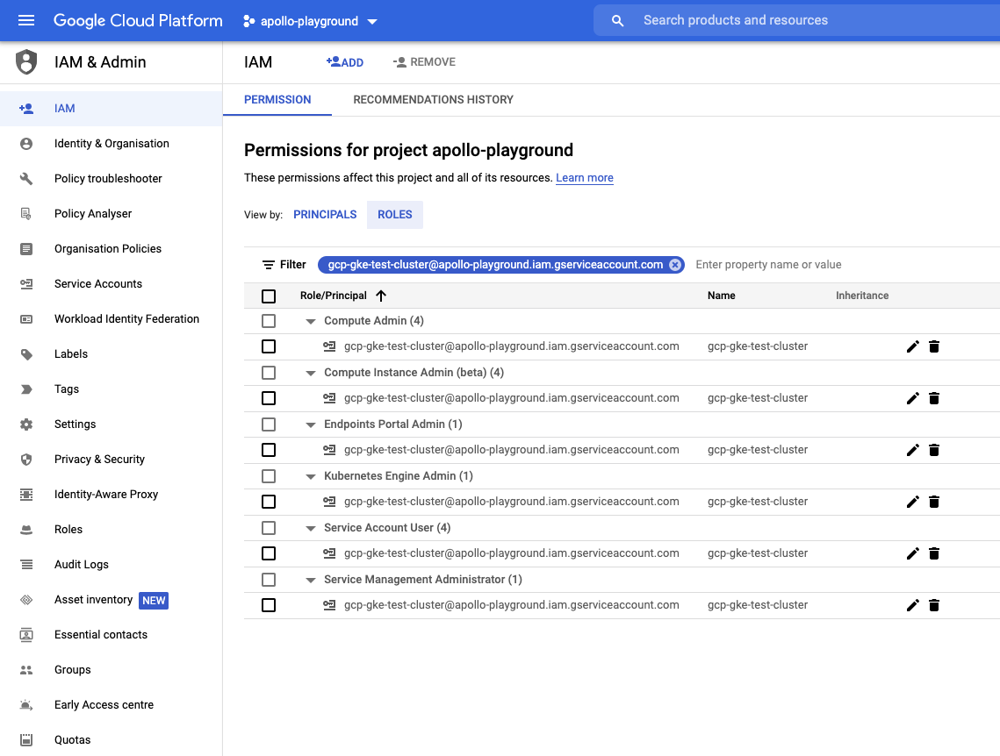

## Requirements

Documentation is applicable for a version **10.4.0-1209.942** or later.

## Pre-requisites

There are a couple of prerequisites which have to be performed in order to run the automation.
You have to:
* You should install [gcloud CLI locally](https://cloud.google.com/sdk/docs/install)
* add to your `~/.gradle/properties` 2 values:
```shell script
accountCredFile=...
accountName=... 
```

For the `accountName` the best is to use service account. To create service account and get json file that is needed for `accountCredFile` use following link: 
[Creating a service account](https://cloud.google.com/docs/authentication/production#create_service_account). Assing to service account following roles 
on the target project: 

More details about IAM policies for GKE are here: [Create IAM policies](https://cloud.google.com/kubernetes-engine/docs/how-to/iam)

## How the full flow works

* Installing a docker based Deploy instance, because we will use Deploy to create necessary resources in kubernetes and to deploy an operator.
* Checking out [Deploy operator](https://github.com/xebialabs/xl-deploy-kubernetes-operator) and modifying the configuration based on the user input
* Installing [XL CLI](https://docs.xebialabs.com/v.10.3/deploy/how-to/install-the-xl-cli/) to apply YAML files 
* Verifying that deployment was successful and all required resources were created in kubernetes. If something went wrong, you'll be notified about it in logs.

You can also check this [operator GCP GKE documentation](https://xebialabs.github.io/xl-deploy-kubernetes-operator/docs/manual/gcp-gke) for 
more information.

All of this is automated and can be triggered by `./gradlew clean :core:startIntegrationServer --stacktrace` with the configuration that is similar
to the following example.

When you would like to stop your cluster you can run `./gradlew :core:shutdownIntegrationServer --stacktrace`.
It will undeploy all CIs, remove all deployed resources on kubernetes and clean all created PVC.

## Example

An example for a complete configuration:

```groovy
deployIntegrationServer {
    cli {
        overlays = [
                ext: [
                        fileTree(dir: "$rootDir/config/cli", includes: ["**/*.py"])
                ],
                lib: [
                        "com.xebialabs.xl-platform.test-utils:py-modules:${testUtilsVersion}@jar"
                ]
        ]
    }
    cluster {
        enable = true
        profile = 'operator'
        publicPort = 10001
    }
    clusterProfiles {
        operator {
            activeProviderName = "gcp-gke"
            gcpGke {
                name = 'gcp-gke-test-cluster'
                storageClass = 'standard-rwo'
                accountName = 'gcp-gke-test-cluster@apollo-playground.iam.gserviceaccount.com'
                projectName = 'apollo-playground'
                regionZone = 'us-central1-a'
                clusterNodeCount = 3
                clusterNodeVmSize = 'e2-standard-2'
            }
        }
    }
    servers {
        server01 {
            dockerImage = "xebialabsunsupported/xl-deploy"
            pingRetrySleepTime = 10
            pingTotalTries = 120
            version = "${xlDeployTrialVersion}"
            overlays = [
                    conf: [
                            fileTree(dir: "$rootDir/config/conf", includes: ["*.*"])
                    ],
            ]
        }
        server02 {
        }
    }
    workers {
        worker01 {
            dockerImage = "xebialabsunsupported/deploy-task-engine"
        }
        worker02 {
        }
    }
}
```

The cluster will be created with amount of servers and workers specified in the configuration. For this case,
 it will create 2 masters and 2 workers. The final URL to connect to UI is: 
 `http://gcp-gke-test-cluster.endpoints.apollo-playground.cloud.goog/xl-deploy/#/explorer` (composed of operator provider name and location).
In case if you want to update the operator and use your own, you can change `operatorImage`. 
Cluster will create with 3 cluster nodes with cluster node-vm-size `e2-standard-2` with 8GB and 4vCPU.  
The geo zone of the cluster will be `us-central1-a`, check with `gcloud compute zones list` for other location.
Storage class here will be used `standard-rwo` that is enabled with addon `GcePersistentDiskCsiDriver` during cluster creation. For details check 
[Using the Compute Engine persistent disk CSI Driver](https://cloud.google.com/kubernetes-engine/docs/how-to/persistent-volumes/gce-pd-csi-driver).
