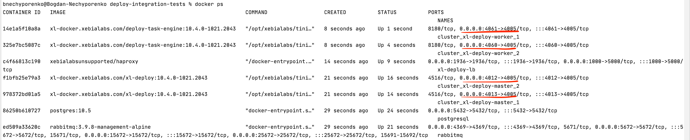
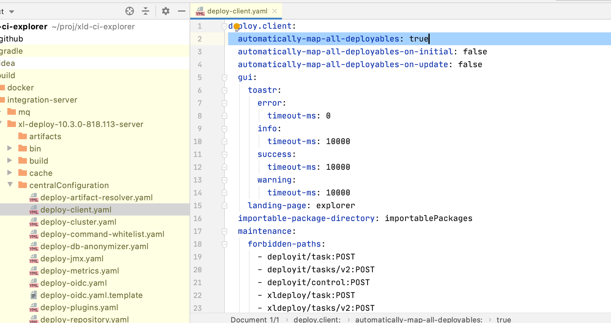

# Configuration

## The first section level

```groovy title=build.gradle
deployIntegrationServer {
    cli {}
    cluster {}
    clusterProfiles {}
    database {}
    maintenance {}
    mqDriverVersions {}
    operatorServer {}
    satellites {}
    servers {}
    tests {}
    xldIsDataVersion {}
    workers {}
}
```

|       Name       |                                                                                  Description                                                                                   |
|:----------------:|:------------------------------------------------------------------------------------------------------------------------------------------------------------------------------:|
|       cli        |                                     The configuration section for Deploy CLI client to run Jython scripts against Deploy server instance.                                      |
|     cluster      |                                                  The configuration section for cluster based setup. By default it's disabled.                                                  |
|     clusterProfiles      |                      In this section you can define multiple profiles for different providers and in cluster section define which profile is active now.                       |
|     database     |                     Database configuration, you can find this section helpful for overriding database driving versions or having more database level logs.                     |
| mqDriverVersions |                                             Points to the version of MQ to use, in case you wish to adapt it to your own version.                                              |
| operatorServer |                   Operator is installed/upgraded with help of Deploy server. It can be configured of different image/version that one is running on cluster.                   |
|    satellites    |                                                             You can configure as many satellites as you need here.                                                             |
|     servers      |       For non-cluster setup, you can specify here only 1 active server, the rest will be ignored. Unless it is a configuration for update from a previous installation.        |
|      tests       |                                                                    You can define Jython based test setups                                                                     |
| xldIsDataVersion | **Only for internal use in Digital.ai** Points to the data which is going to be imported after server is booted. To run waste the time to generate a huge amount of test data. |
|     workers      |                                                              You can configure as many workers as you need here.                                                               |

## CLI section

```groovy title=build.gradle
deployIntegrationServer {
    cli {
        cleanDefaultExtContent = true
        copyBuildArtifacts = [
           lib: /(.+)[.](jar)/
        ]
        debugPort = 4005
        debugSuspend = true
        enable = false
        filesToExecute = [file("src/main/resources/provision.py")]
        overlays = [
            ext: [
                    files("ext") 
            ],
            lib: [
                    "com.xebialabs.xl-platform.test-utils:py-modules:${testUtilsVersion}@jar"
            ]
        ]
        socketTimeout = 120000
        version = "10.2.2"
    }
}
```

|Name|Type|Default Value|Description|
| :---: | :---: | :---: | :---: |
|cleanDefaultExtContent|Optional|false|By default in CLI there are 3 files included in the ext with some helper functions. You can remove it if it clashes with your scripts.|
|copyBuildArtifacts|Optional|[:]|Here you can define what would you like to include to integration server from the build process itself. For example you run: `./gradlew build integrationServer` and you create `*.jar` of your plugin which you would like to include to integration server. You have to specify it here. As for overlay it won't work. With overlay to make it work you have to run 2 commands: `./gradlew build` and then `./gradlew startIntegrationServer`. Key is a relative folder name from CLI base, and a value is a pattern to all files located in `build` folder except `integration-server` sub-folder. This one is excluded.|
|debugPort|Optional|None|Remote Debug Port for Deploy CLI | 
|debugSuspend|Optional|false|Suspend the start of the process before the remoting tool is attached.|
|enable|Optional|true|You can disable it, if you don't want to work with it, and it won't be downloaded.|
|filesToExecute|Optional|[]|The list of files which will be executed after Deploy Server (workers and satellite if configured) started. You can use it to provision your server with data before running the tests.|
|overlays|Optional|[:]|[Read about this section below](#overlays)|
|socketTimeout|Optional|60000|Time is set in ms. Socket timeout means how long the socket will be opened to execute the provided script. If your script takes a time to be executed, consider to increase it.|
|version|Optional|None|It can be specified in several ways. Or as a gradle property `deployCliVersion`, via parameter or in `gradle.properties` file or explicitly via this field. As a last resource it also checks on `xlDeployVersion`, as usually the version should be the same, but you have a possibility to define different versions. |

## Cluster section

```groovy title=build.gradle
deployIntegrationServer {
    cluster {
        debugSuspend = true
        enable = true
        enableDebug = true
        profile = 'operator'
        publicPort = 1000
    }
}
```

|Name|Type|Default Value|Description|
| :---: | :---: | :---: | :---: |
|debugSuspend|Optional|false|Suspend the start of the process before the remoting tool is attached. Take in mind that you have to attach to all processes to be able to completely run the cluster.|
|enable|Optional|false|If true, cluster setup will be enabled.|
|enableDebug|Optional|false|If true, debug will be enabled on all masters and workers. The exposed ports to connect will be randomly defined. You can check with `docker ps` which port was exposed for debugging.|
|profile|Optional|dockerCompose|The way to run the setup. There are 2 possible ways now: dockerCompose or operator. If you use operator, you have to configure `clusterProfiles` section too.
|publicPort|Optional|8080|The port to connect to the cluster.|

Example for dockerCompose configuration:

```groovy title=build.gradle
deployIntegrationServer {
    cluster {
        enable = true
    }
    servers {
        server01 {
            dockerImage = "xebialabs/xl-deploy"
            version = "10.4.0" // not released yet
        }
        server02 {
        }
    }
    workers {
        worker01 {
            dockerImage = "xebialabs/deploy-task-engine"
        }
        worker02 {
        }
    }
}
```

You can define less or more servers and workers. The docker image is being read from the first server and 
first worker sections. Version is enough to specify only in the first server section, as server and worker versions 
should always match.

Example where to check for debugging ports to attach:



Example for operator configuration:

```shell script
    ...
    cluster {
        enable = true
        profile = 'operator'
        publicPort = 10001
    }
    clusterProfiles {
        operator {
            activeProviderName = "aws-openshift"
            awsOpenshift {
                apiServerURL = 'https://yourhost.openshiftapps.com:6443'
                host = 'router-default.yourhost.openshiftapps.com'
                name = 'aws-openshift-test-cluster'
                oauthHostName = "oauth-openshift.yourhost.openshiftapps.com"
                operatorImage = 'acierto/deploy-operator:1.0.6-openshift'
                operatorPackageVersion = "1.0.7"
            }
        }
    }
    ...
```

## Cluster profiles for operator

```shell script
clusterProfiles {
    operator {
        activeProviderName = "aws-openshift"
        awsOpenshift {
            apiServerURL = 'https://api.acierto.lnfl.p1.openshiftapps.com:6443'
            host = 'router-default.apps.acierto.lnfl.p1.openshiftapps.com'
            name = 'aws-openshift-test-cluster'
            oauthHostName = "oauth-openshift.apps.acierto.lnfl.p1.openshiftapps.com"
            operatorImage = 'acierto/deploy-operator:1.0.6-openshift'
            operatorPackageVersion = "1.0.1"
        }
        azureAks {
            clusterNodeCount = 3
            clusterNodeVmSize = 'Standard_DS2_v2'
            kubernetesVersion = '1.20'
            location = 'northcentralus'
            name = 'azure-aks-test-cluster'
            skipExisting = false
            azUsername = 'azure_username'
            azPassword = 'secret'
        }
        gcpGke {
            accountCredFile = 'path_to_the_cred_json_file'
            accountName = 'gcp-gke-usert@apollo-playground.iam.gserviceaccount.com'
            clusterNodeCount = 3
            clusterNodeVmSize = 'e2-standard-2'
            kubernetesVersion = '1.20.11-gke.1801'
            name = 'gcp-gke-test-cluster'
            projectName = 'apollo-playground'
            regionZone = 'us-central1-a'
            skipExisting = false
        }        
        onPremise {
            name = 'onprem-test-cluster'
            clusterNodeCpus = 4
            clusterNodeMemory = 15000
            kubernetesVersion = '1.20.0'
            skipExisting = false
        }
        awsEks {
            region = "us-east-1"
            stack = "deploy-operator-test"
            clusterName = "deploy-operator-cluster-test"
            nodeGroupName = "deploy-operator-cluster-nodegroup"
            clusterNodeCount = 2
            sshKeyName = "deploy-operator-ssh-key"
            fileSystemName = "deploy-operator-efs-test"
            kubernetesVersion = "1.20"
            skipExisting = true
            stackTimeoutSeconds = 1500000
            stackSleepTimeBeforeRetrySeconds = 300000
            route53InsycAwaitTimeoutSeconds = 300000
            accessKey = "AWS access key"
            secretKey = "AWS Secret key"
        }
    }
}
```

### AWS Openshift profile 

`activeProviderName = "aws-openshift"`

|Name|Type|Default Value|Description|
| :---: | :---: | :---: | :---: |
|apiServerURL|Mandatory|-|The URL to your OpenShift cluster server API|
|host|Mandatory|-|The public host on which cluster will be available to interact with. Basically it is your OpenShift router URL.|
|keystorePassphrase|Optional|test123|Keystore password to encrypt sensitive information in CIs|
|name|Mandatory|-|The name of your cluster.|
|operatorImage|Optional|xebialabs/deploy-operator:1.2.0-openshift|The image of operator which is going to be used to install the Deploy cluster|
|operatorPackageVersion|Optional|1.0.0|We deploy operator with help of Deploy, this is a version which will be used as a application package version.|
|oauthHostName|Mandatory|-|OAuth host name of your OpenShift cluster. It is used to get a new token based on your credentials. This token is required to interact with OpenShift cluster.|
|repositoryKeystore|Optional|Provided|Keystore to encrypt sensitive information in CIs|
|storageClass|Optional|aws-efs|You can use another storage class, but you have to be sure that it is NFS based, otherwise it won't work.|

### Azure AKS profile 

`activeProviderName = "azure-aks"`

|          Name          |   Type    |             Default Value             |                                                  Description                                                   |
|:----------------------:|:---------:|:-------------------------------------:|:--------------------------------------------------------------------------------------------------------------:|
|       azUsername       | Mandatory |                   -                   |                                  Azure username to be used with az cli tool.                                   |
|       azPassword       | Mandatory |                   -                   |                                  Azure password to be used with az cli tool.                                   |
|    clusterNodeCount    | Optional  |                   2                   |                   Number of the nodes that will be created during cluster creation on Azure.                   |
|   clusterNodeVmSize    | Optional  | Standard_DS2_v2 (Azure default value) |                                          Node VM size named on Azure.                                          |
|   kubernetesVersion    | Optional  |     Default Azure version is 1.20     |                      The kubernetes version that will be custom string for each provider.                      |
|        location        | Mandatory |                   -                   |                 The Azure location that represents geo location where cluster will be running.                 |
|          name          | Mandatory |                   -                   |                                           The name of your cluster.                                            |
|     operatorImage      | Optional  |    xebialabs/deploy-operator:1.2.0    |                 The image of operator which is going to be used to install the Deploy cluster                  |
| operatorPackageVersion | Optional  |                 1.2.0                 | We deploy operator with help of Deploy, this is a version which will be used as a application package version. |
|      skipExisting      | Optional  |                 true                  |         For some cluster resources there are checks if resources exist, if set to true skip creation.          |
|      storageClass      | Optional  |                   -                   |         Storage class prefix. On Azure with prefix are created new classes for file and disk storage.          |

### GCP GKE profile

`activeProviderName = "gcp-gke"`

|          Name          |   Type    |           Default Value           |                                                  Description                                                   |
|:----------------------:|:---------:|:---------------------------------:|:--------------------------------------------------------------------------------------------------------------:|
|    accountCredFile     | Optional  |                 -                 |                             A file path to read the access token credentials file.                             |
|      accountName       | Mandatory |                 -                 |                            GCP user account that will be used with `gcloud` plugin.                            |
|    clusterNodeCount    | Optional  |                 3                 |                    Number of the nodes that will be created during cluster creation on GCP.                    |
|   clusterNodeVmSize    | Optional  | Medium_DS2_v2 (GCP default value) |                                           Node VM size named on GCP.                                           |
|   kubernetesVersion    | Optional  |         1.20.11-gke.1801          |                      The kubernetes version that will be custom string for each provider.                      |
|          name          | Mandatory |                 -                 |                                           The name of your cluster.                                            |
|     operatorImage      | Optional  |  xebialabs/deploy-operator:1.2.0  |                 The image of operator which is going to be used to install the Deploy cluster                  |
| operatorPackageVersion | Optional  |               1.2.0               | We deploy operator with help of Deploy, this is a version which will be used as a application package version. |
|      projectName       | Mandatory |                 -                 |                             The GCP project in which GKE cluster will be created.                              |
|       regionZone       | Mandatory |                 -                 |                         The cluster GEO zone where cluster instances will be located.                          |
|      skipExisting      | Optional  |               true                |         For some cluster resources there are checks if resources exist, if set to true skip creation.          |
|      storageClass      | Optional  |             standard              |   You can use another storage class, but you have to be sure that it is NFS based, otherwise it won't work.    |

### Onprem Minikube profile 

`activeProviderName = "onprem"`

|          Name          |   Type    |              Default Value               |                                                  Description                                                   |
|:----------------------:|:---------:|:----------------------------------------:|:--------------------------------------------------------------------------------------------------------------:|
|    clusterNodeCpus     | Optional  |                    -                     |                                  Number of CPUs that will be used by cluster.                                  |
|   clusterNodeMemory    | Optional  |                    -                     |                                Memory size in MB that will be used by cluster.                                 |
|   kubernetesVersion    | Optional  |                  1.20.0                  |                      The kubernetes version that will be custom string for each provider.                      |
|          name          | Mandatory |                    -                     |                                           The name of your cluster.                                            |
|     operatorImage      | Optional  |     xebialabs/deploy-operator:1.2.0      |                 The image of operator which is going to be used to install the Deploy cluster                  |
| operatorPackageVersion | Optional  |                  1.2.0                   | We deploy operator with help of Deploy, this is a version which will be used as a application package version. |
|      skipExisting      | Optional  |                   true                   |         For some cluster resources there are checks if resources exist, if set to true skip creation.          |
|      storageClass      | Optional  |                 standard                 |   You can use another storage class, but you have to be sure that it is NFS based, otherwise it won't work.    |


### AWS EKS profile 

`activeProviderName = "aws-eks"`

|          Name          |   Type    |             Default Value             |                                                  Description                                                   |
|:----------------------:|:---------:|:-------------------------------------:|:--------------------------------------------------------------------------------------------------------------:|
|       accessKey        | Optional |                   -                    |    AWS AccessKey to access aws cli tool.                                                                       |
|       secretKey        | Optional |                   -                    |    AWS SecretKey to access aws cli tool.                                                                       |
|       region           | Optional |               'us-east-1'              |    Region where the cluster to be created.                                                                     |
|       stack            | Optional |          'deploy-operator-test'        |    Name of the AWS stack.                                                                                      | 
|    clusterName         | Optional |        'deploy-operator-cluster-test'  |    Name of the AWS EKS Cluster.                                                                                |
|   nodeGroupName        | Optional |   'deploy-operator-cluster-nodegroup'  |    Name of the nodeGroup. At present only two node groups are support.                                         |
|   clusterNodeCount     | Optional |                   2                    |    Number of the worker nodes to be created within node group, max node count of each group is 8.              |
|   kubernetesVersion    | Optional |     Default version is 1.20            |    The kubernetes version that will be custom string for each provider.                                        |
|   sshKeyName           | Optional |   'deploy-operator-ssh-key'            |    ssh key for accessing Amazon EC2 instance.                                                                  |
|   fileSystemName       | Optional |   'deploy-operator-efs-test'           |    AWS EFS file system name.                                                                                   |
|     operatorImage      | Optional |    xebialabs/deploy-operator:1.2.0     |                 The image of operator which is going to be used to install the Deploy cluster                  |
| operatorPackageVersion | Optional |                 1.2.0                  | We deploy operator with help of Deploy, this is a version which will be used as a application package version. |
|      skipExisting      | Optional |                 true                   |         For some cluster resources there are checks if resources exist, if set to true skip creation.          |
| stackTimeoutSeconds    | Optional |  1500000                               |  Maximum wait time for 'Stack Creation' or 'Stack Deletion' in seconds.                                        |
| stackSleepTimeBeforeRetrySeconds| Optional| 300000                         |  Polling period in seconds for 'Stack Creation' or 'Stack Deletion'.                                           |
| route53InsycAwaitTimeoutSeconds| Optional | 300000                         |  Polling period in seconds for route53 provisioning.                                                           | 
|      storageClass      | Optional |                "aws-efs && gp2'        |   Use gp2 storageclass for postgres and rabbitmq and  use 'aws-efs' storageclass for xl-deploy pods            |
                                                                                                                                         

## Servers section

```groovy title=build.gradle
deployIntegrationServer {
   servers {
       controlPlane { // The name of the section, you can name it as you wish
           akkaSecured = true
           contextRoot = "/custom"
           copyBuildArtifacts = [
                "plugins/xld-official": /(.+)[.](xldp)/
           ]
           copyFolders = [
                file("config/ext"): "ext"
           ]
           debugPort = 4005
           debugSuspend = true
           defaultOfficialPluginsToExclude = ["xld-terraform-plugin-10.1.0", "xld-aws-plugin-10.2.1"]
           devOpsAsCodes {
                first {
                    devOpAsCodeScript = file("${buildDir}/resources/main/xld/devopsAsCode/infrastructure.yaml")
                    scmAuthor = "John Doe <john.doe@organization.co>"
                    scmCommit = "6f13f85ca0fa3d7299f195a4a4b1bc95946b98a5"
                    scmDate = "2021-05-16T12:27:19.000Z"
                    scmFile = file("${buildDir}/resources/main/xld/devopsAsCode/infrastructure.yaml")
                    scmMessage = "Create Infrastructure"
                    scmRemote = "git@github.com:xebialabs/integration-server-gradle-plugin.git"
                    scmType = "git"
                }
           }
           dockerImage = "xebialabs/xl-deploy" 
           httpPort = 4516
           generateDatasets = []
           jvmArgs = ["-Xmx1024m", "-Duser.timezone=UTC"]
           logLevels = ["com.xebialabs.deployit.plugin.stitch": "debug"]
           overlays = [
               'build/artifacts': ["${ciExplorerDataDependency}:artifacts@zip"],
               conf             : [
                   "${ciExplorerDataDependency}:configuration@zip",
                   files("src/test/xld/deployit-license.lic")
               ],
               ext              : ["${ciExplorerDataDependency}:extensions@zip"],
               lib              : [project.tasks.getByName("jar").outputs.files],
               'plugins/xld-official': [
                   "com.xebialabs.deployit.plugins:xld-ci-explorer:${xldCiExplorerVersion}@xldp", 
               ], 
               'xldrepo': ["${ciExplorerDataDependency}:repository@zip"],
           ]
           pingRetrySleepTime = 5
           pingTotalTries = 120
           removeStdoutConfig = true
           runtimeDirectory = "server-runtime"
           stdoutFileName = 'deploy-server-runtime.log'
           tls = true
           version = '10.2.2'
           yamlPatches = [
               'centralConfiguration/deploy-server.yaml': [
                   'deploy.server.aggregation-timeout': 5 seconds,
                   'deploy.server.label': 'XLD'
               ]
           ]     
       }       
   }   
}
```

|Name|Type|Default Value|Description|
| :---: | :---: | :---: | :---: |
|akkaSecured|Optional|false|Runs akka communication with worker with enabled TLS TCP. All keys, keystores and truststores are generated per master, worker and satellite.| 
|copyBuildArtifacts|Optional|[:]|Here you can define what would you like to include to integration server from the build process itself. For example you run: `./gradlew build integrationServer` and you create `*.xldp` of your plugin which you would like to include to integration server. You have to specify it here. As for overlay it won't work. With overlay to make it work you have to run 2 commands: `./gradlew build` and then `./gradlew startIntegrationServer`. Key is a relative folder name from Deploy base, and a value is a pattern to all files located in `build` folder except `integration-server` sub-folder. This one is excluded.|
|copyFolders|Optional|[:]|It is an additional option to copy folders to preserve the folder structure. Overlay will flatten it, if you'll try to do the same.|
|contextRoot|Optional|/|The context root for Deploy. **Limitation:** *Doesn't work for docker setup*|
|debugPort|Optional|None|Remote Debug Port for Deploy Server| 
|debugSuspend|Optional|false|Suspend the start of the process before the remoting tool is attached.| 
|defaultOfficialPluginsToExclude|Optional|[]|The list of plugins which are going to be excluded from the **plugins/xld-official** before the booting the server. Expected input is the list of strings separated by comma. Exclusion is happening by name convention. If for example you will say "plugin", all plugins going to be removed.| 
|devOpsAsCodes|Optional|None|[Read about this section below](#dev-ops-as-code)|
|dockerImage|Optional|None|When this property is specified, docker based setup will be performed. The name of the docker image, without version. Version is specified in the separate field or dedicated from gradle properties.|
|generateDatasets|Optional|[]|The url `"http://localhost:${server.httpPort}/deployit/generate/${dataset}"` is going to be hit. This URL point is not available in Deploy by default. How you can develop it, is going to be described soon in a blog.|
|httpPort|Optional|Random port|The HTTP port for Deploy server.|
|jvmArgs|Optional|[]|JVM arguments which are going to be used on Server startup|
|logLevels|Optional|[:]|Custom log levels to be included in logback.xml configuration. Expected format is a map, where the key is the package name and value the log level.|
|overlays|Optional|[:]|[Read about this section below](#overlays)|
|pingRetrySleepTime|Optional|10|During the startup of the server we check when it's completely booted. This property configures how long to sleep (in seconds) between retries.|
|pingTotalTries|Optional|60|During the startup of the server we check when it's completely booted. This property configures how many times to retry.|
|runtimeDirectory|Optional|None|When this property is specified, runtime directory setup will be performed. Just make sure that you have complete deploy instance present there.|
|stdoutFileName|Optional|None|The filename that stores standard output and error for server runtime. If not present output is discarded. Note: it should be used only for debugging purposes: if used with class loaded runtime (runtimeDirectory) it will block execution after startup because, for that case, limitations in process spawning |
|version|Optional|None|It can be specified in several ways. Or as a gradle property `xlDeployVersion`, via parameter or in `gradle.properties` file or explicitly via this field.|
|tls|Optional|false|If enabled use HTTPS for API communication with master.|
|yamlPatches|Optional|[:]|[Read about this section below](#yaml-patches)|
|previousInstallation|Optional|false|Is the server the previous installed version to be used a as source for upgrade.|

### Dev Ops As Code

Applies Dev Ops as code YAML files with extra metadata applied to it (mocked Git metadata associated with the file).

The example of such YAML file is:

```yaml title=devop-as-code-sample.yaml
apiVersion: xl-deploy/v1
kind: Applications
spec:
  - name: Applications/WithGitMetaInfo
    type: udm.Application
    children:
      - name: "1.0.1"
        type: udm.DeploymentPackage
      - name: "1.0.2"
        type: udm.DeploymentPackage

```

Read more about devops as code here: 
[https://docs.xebialabs.com/v.10.2/deploy/how-to/work-with-xl-yaml-format-for-deploy/#yaml-file-fields](https://docs.xebialabs.com/v.10.2/deploy/how-to/work-with-xl-yaml-format-for-deploy/#yaml-file-fields) 

|Name|Type|Default Value|Description|
| :---: | :---: | :---: | :---: |
|devOpAsCodeScript|Mandatory|None|The path to the script.|
|scmAuthor|Mandatory|None|The author of the commit.|
|scmCommit|Mandatory|None|The Git commit hash.|
|scmDate|Mandatory|None|The date of the commit.|
|scmFile|Mandatory|None|The path of the file|
|scmMessage|Mandatory|None|The Git commit message.|
|scmRemote|Mandatory|None|The Git repository URI.|
|scmType|Mandatory|None|SCM type, for example: git, svn, mercury|


### Overlays

With overlays, you can override any file in any folder in Deploy. <br/>
Overlay is a map, where key is a path of the folder, and value - the file which going to be added or overwritten.  

Example: 

```groovy title=build.gradle
overlays = [
   'build/artifacts': ["${ciExplorerDataDependency}:artifacts@zip"],
   conf             : [
       "${ciExplorerDataDependency}:configuration@zip",
       files("src/test/xld/deployit-license.lic")
   ],
   ext              : ["${ciExplorerDataDependency}:extensions@zip"],
   lib              : [project.tasks.getByName("jar").outputs.files],
   'plugins/xld-official': [
       "com.xebialabs.deployit.plugins:xld-ci-explorer:${xldCiExplorerVersion}@xldp", 
   ], 
   'xldrepo'        : ["${ciExplorerDataDependency}:repository@zip"],
]
```

:::caution

With Docker based setup you can override only folders which are mounted from Docker image.
Namely:

 * **conf**
 * **ext**
 * **hotfix/lib**
 * **hotfix/plugins**
 * **plugins**
 * **repository**
 * **work**
 
:::


### YAML patches

Central configuration files are YAML files. There are predefined values there which you might want to custom for your needs,
before starting the integration server. Though the feature is not limited to central configuration files only.
You still can point to any folder and create/overwrite any file you wish. The configuration is a map (key -> map),
where a key is a folder path and value is another map, in which key is the path to the property and value is a value of the property.

For example, if you want to modify in `deploy-client.yaml` file the `automatically-map-all-deployables` to `false`, you have 
to do:



```groovy
yamlPatches = [
   'centralConfiguration/deploy-client.yaml': [
       'deploy.client.automatically-map-all-deployables': 'false'
   ]
]  
```


## Database section

```groovy title=build.gradle
deployIntegrationServer {
   database { 
      databasePort = 10000
      driverVersions = [
             'mssql'        : '11.2.3.jre17',
             'mysql'        : '8.1.0',
             'mysql-8'      : '8.1.0',
             'oracle-19c-se': '21.1.0.0',
             'postgres-10'  : '42.6.0',
             'postgres-12'  : '42.6.0',
      ]
      logSql = true
   }
}
```

|Name|Type|                                                           Default Value                                                            |Description|
| :---: | :---: |:----------------------------------------------------------------------------------------------------------------------------------:| :---: |
|databasePort|Optional|                                                           Random number                                                            |The port on which database is going to be started.|
|driverVersions|Optional| ['mssql':'11.2.3.jre17','mysql':'8.1.0','mysql-8':'8.1.0','oracle-19c-se':'21.1.0.0','postgres-10':'42.6.0','postgres-12':'42.6.0'] ||
|logSql|Optional|                                                               false                                                                |If true, enables tracing all SQL queries|

The most important what you have to know regarding the database configuration is, choosing which database to run is happening 
now on the level of project property `database`. It means that you can specify it in 2 ways:

* adding a parameter via `-Pdatabase`
* In the root of your project in `gradle.properties` file

```properties title=gradle.properties
database=derby-network
```

If nothing specified, **derby in memory** is going to be used.

## Maintenance section

```groovy
deployIntegrationServer {
    maintenance {
        cleanupBeforeStartup = [
                file("ext/ci.py"),
                file("ext/default-imports.py"),
                file("ext/readme.cli")
        ]
    }
}
```

|Name|Type|Default Value|Description|
| :---: | :---: | :---: | :---: |
|cleanupBeforeStartup|List|[]|The list of files/folders to clean up before next server run.|

## Workers section

Whenever you have to distribute the load of your system and parallelize the deployment execution you can configure workers.
In real case scenario you can run workers as on the same as well as on different VMs.
There are 3 types of workers: 
* internal worker which is embedded to a server, when no workers configured.
* local workers, when extra JVM processed is spanned from the same folder
* external workers, when you run the worker from another folder on the same or different VM
 
Read more about workers here:
[https://docs.xebialabs.com/v.10.2/deploy/concept/high-availability-with-master-worker-setup/#preparing-multiple-masters](https://docs.xebialabs.com/v.10.2/deploy/concept/high-availability-with-master-worker-setup/#preparing-multiple-masters)

**Integration Server** currently support running only on the same VM.

```groovy
deployIntegrationServer {
    workers {
        worker01 {  // The name of the section, you can name it as you wish
            version = "10.2.2" // Optional, if not specified will use same version as Server
        }
        worker02 {  // The name of the section, you can name it as you wish
            debugPort = 5006
            debugSuspend = true
            jvmArgs = ["-Xmx1024m", "-Duser.timezone=UTC"]
        }
        worker03 {  // The name of the section, you can name it as you wish
            debugPort = 5007
            debugSuspend = false
            runtimeDirectory = "/opt/xl-deploy-worker"
            slimDistribution = true 
            stdoutFileName = 'worker.log'
            jvmArgs = ["-Xmx1024m", "-Duser.timezone=UTC"]
            port = 8182
        }
    }
}
```

|Name|Type|Default Value|Description|
| :---: | :---: | :---: | :---: |
|debugPort|Optional|None|Remote Debug Port for a worker.|
|debugSuspend|Optional|None|Suspend the start of the process before the remoting tool is attached.|
|jvmArgs|Optional|None|JVM arguments which are going to be used on a worker startup.|
|logLevels|Optional|[:]|Custom log levels to be included in logback.xml configuration. Expected format is a map, where the key is the package name and value the log level.|
|overlays|Optional|[:]|[Read about this section below](#overlays)|
|port|Optional|None|Port on which worker will start.|
|runtimeDirectory|Optional|None|If specified, it will run external worker, from the different folder location than server. It will not try to download released version.|
|slimDistribution|Optional|false|When false runs worker within cloned xl-deploy directory. If true runs worker from downloaded deploy-task-engine. Default is false. |
|stdoutFileName|Optional|None|The filename that stores standard output and error for worker runtime. If not present output is discarded. Note: it should be used only for debugging purposes: if used with class loaded runtime (runtimeDirectory) it will block execution after startup because, for that case, limitations in process spawning |
|version|Optional|None|It can be specified in several ways. Or as a gradle property `deployTaskEngineVersion`, via parameter or in `gradle.properties` file or explicitly via this field. If not specified, it will take the same version as Server.|

:::caution

Docker based setup currently don't support workers. 

:::

## Central Configuration Server section
In order to maintain the configurations across different services, the central configuration server is used.
This serves the configurations to services based on profiles.

Read more about central configuration here:
[https://docs.xebialabs.com/v.10.2/deploy/concept/central-configuration-overview/](https://docs.xebialabs.com/v.10.2/deploy/concept/central-configuration-overview/)

```groovy
deployIntegrationServer {
    centralConfigurationServer {
        enable = true
        httpPort = 8888
        overlays = [
                centralConfiguration: [
                        files("$rootDir/setups/external-cc-itest/deploy-client.yaml")
                ]
        ]
        yamlPatches = [
                'centralConfiguration/deploy-server.yaml': [
                        'deploy.server.label': 'Deploy Hello World'
                ],
                "centralConfiguration/deploy-repository.yaml": [
                        "xl.repository.artifacts.allow-move": true,
                        "xl.repository.artifacts.type"      : "db"
                ]
        ]
    }
}
```

|Name|Type|Default Value|Description|
| :---: | :---: | :---: | :---: |
|enable|Optional|false|If you need the Central Configuration Server, this should be true.|
|httpPort|Optional|Random port|The HTTP port for Central Configuration Server.|
|overlays|Optional|[:]|[Read about this section below](#overlays)|
|version|Optional|None|It can be specified in several ways. Or as a gradle property `centralConfigurationVersion`, via parameter or in `gradle.properties` file or explicitly via this field.|
|yamlPatches|Optional|[:]|[Read about this section below](#yaml-patches)|

:::caution

Docker based setup currently don't support Central Configuration Server.

:::

## Satellites section

In comparison with workers, the goal for a satellite is to perform deployments on the different network with Deploy. When
the connection between networks is not fast and less reliable. <br/>

**Integration Server** at this moment doesn't simulate slow network, but rather allows you to test that the functionality 
properly works on a satellite. A satellite itself is installed on the same VM. <br/>

You can read more about a satellite here: 
[https://docs.xebialabs.com/v.10.2/deploy/concept/getting-started-with-the-satellite-module/](https://docs.xebialabs.com/v.10.2/deploy/concept/getting-started-with-the-satellite-module/)

```groovy
deployIntegrationServer {
    satellites {
       satellite01 {  // The name of the section, you can name it as you wish
            akkaStreamingPort = 8481
            debugPort = 5008
            debugSuspend = true
            metricsPort = 8081
            overlays = [
                lib              : [files("src/test/resources/my-library.jar")],
                ext              : ["src/test/resources/synthetic.xml"]
            ]      
            serverAkkaBindHostName = "0.0.0.0"
            serverAkkaHostname = "127.0.0.1"
            serverAkkaPort = 8381 
            stdoutFileName = "satellite-startup.log"
            syncPlugins = false
            version = "10.2.2"
       }   
    }
}
```

|Name|Type|Default Value|Description|
| :---: | :---: | :---: | :---: |
|akkaStreamingPort|Optional|8480|Streaming Akka port between Satellite and Server|
|debugPort|Optional|None|Remote Debug Port for a satellite.|
|debugSuspend|Optional|None|Suspend the start of the process before the remoting tool is attached.|
|metricsPort|Optional|8080|Port for gathered (JMX) metrics on Satellite|
|overlays|Optional|[:]|Identical to Server overlays, only in a satellite. [Read about this section below](#overlays)|
|serverAkkaBindHostName|Optional|0.0.0.0|Akka bind host name of the Server|
|serverAkkaHostname|Optional|127.0.0.1|Akka host name of the Server|
|serverAkkaPort|Optional|8380|Akka port between Satellite and Server|
|stdoutFileName|Optional|None|The filename that stores standard output and error for server runtime. If not present output is discarded. |
|syncPlugins|Optional|true|If true, plugins will be synchronized from the server.|
|version|Optional|None|It can be specified in several ways. Or as a gradle property `xlSatelliteVersion`, via parameter or in `gradle.properties` file or explicitly via this field.|

:::caution

Docker based setup currently don't support satellites. 

:::

## MQ Driver Versions

Message Queue Drivers are by default chosen by the plugin, you can change that, and this is exactly what this section about.

That's how your can override it: 

```groovy
deployIntegrationServer {
    mqDriverVersions {
        [
            'activemq': '5.16.2',
            'rabbitmq': '2.2.0'
        ]
    }
}
```

In this sample you can see the default values used in the plugin.

### Operator server section

|Name|   Type   |Default Value|                                                                   Description                                                                   |
| :---: |:--------:| :---: |:-----------------------------------------------------------------------------------------------------------------------------------------------:|
|dockerImage| Required |None|                                         It has to be specified explicitly. In case of no value provided, it will be the same as cluster Deploy version                                         |
|httpPort| Optional |Random port|               Public http port for Deploy server. Can be useful in case of troubleshooting of the failed deployment of operator.                |
|pingRetrySleepTime| Optional |10| During the startup of the server we check when it's completely booted. This property configures how long to sleep (in seconds) between retries. |
|pingTotalTries| Optional |60|            During the startup of the server we check when it's completely booted. This property configures how many times to retry.             |
|version| Optional |None|                 It has to be specified explicitly. In case of no value provided, it will be the same as cluster Deploy version                  |

## XLD Integration Server Data Version

Currently, this is used only internally in Digital.ai to point to a package with imported data. <br/>
Before server starts, database is going to be populated by the imported data, to save the time during test run.

## Cache Server

We can use a standalone cache server to be used with Deploy master/worker. Only Infinispan Cache Server is supported for now.
In order to use the cache server, set the `useCache` project property as true. 
In addition to the `useCache` property, the cache server will be started only 
if there are more than one Deploy Servers or Deploy Worker. 
The Infinispan Cache Server by default will be started on `11222`  port. 
You can change this by passing a specific port through the `cachePort` project property. 

```groovy
deployIntegrationServer {
    servers {
      controlPlane {
        ...
        overlays = [
            conf                  : [
                files("src/test/resources/infinispan-hotrod.properties")
            ],
            centralConfiguration: [
                files("src/test/resources/deploy-caches.yaml")
            ]
        ]
      }
    }
    workers {
      worker01 {
        ...
    }
  }
}
```

* Adding infinispan-hotrod.properties  to conf dir makes it available in class path (can be done in otherways too)
* Modify deploy-caches.yaml as per need to enable/disable specific caches and specify the configuration file name for infinispan

## Tests section

You can create Jython based tests and communicate with Deploy through CLI.

To run tests you have to run `./gradlew integrationTests`. It is not a part of `startIntegrationServer` intentionally.
The server start up takes time, especially if also workers and satellites are configured. During development of the tests, you don't want
to reboot it every time, but rather run tests against the configured instance. 

Therefore first you run the server with `./gradlew clean startIntegrationServer` and the you can run multiple times `./gradlew integrationTests`. 

You can also run both commands in one command as: `./gradlew clean startIntegrationServer integrationTests`.

```groovy
deployIntegrationServer {
    tests {
        base {
            base = true
            extraClassPath = [file("src/test/resources")]
            scriptPattern = /\/jython\/ci\/(.+).py$/
        }
        testGroupO1 { // The name of the section, you can name it as you wish
            baseDirectory = file("src/test")
            extraClassPath = [file("src/test/resources/group-01")]
            scriptPattern = /\/jython\/ci\/group-01\/(.+).py$/
            setupScripts = ["provision/setup.py", "provision/azure/setup.py"]
            systemProperties = [
                    'key1': 'value1',
                    'key2': 'value2',
            ]
            tearDownScripts = ["provision/azure/teardown.py", "provision/teardown.py"]
        }
    }
}
```

|Name|Type|Default Value|Description|
| :---: | :---: | :---: | :---: |
|base|Optional|`false`|If to define `base` test section, it will be not executable, but sharing the same configuration across all executable test sections. If same property is defined in test section itself, it overrides base defined property.|
|baseDirectory|Mandatory|None|You have to specify here the base directory where your test setup is located.|
|extraClassPath|Optional|[]|You can point to a folder with your Jython utility scripts which you would like to use in other scripts to eliminate code duplication.|
|scriptPattern|Optional|/(.+)[.](py &#124; cli)/|The pattern which will filter the tests you want to run. By default it will run all tests which have extension `py` or `cli` and reside inside base directory.|
|setupScripts|Optional|[]|Provision scripts which will be triggered before running all tests.|
|systemProperties|Optional|[:]|You can provide system properties inside your tests and then access it like `System.getProperty("key1")`|
|tearDownScripts|Optional|[]|As the best practice to clean everything created by test(s), these scripts is exactly the place to do it. It will be triggered regardless if test was successful or not.|
