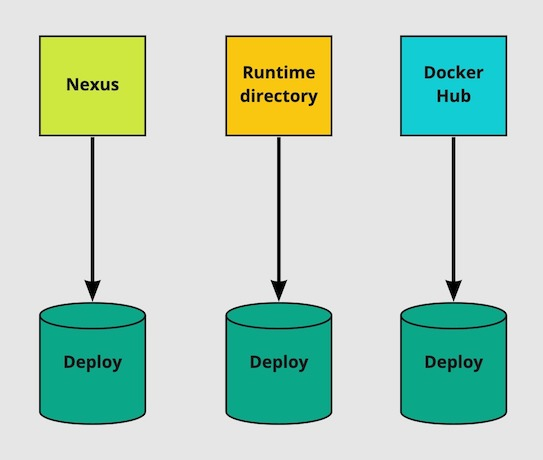
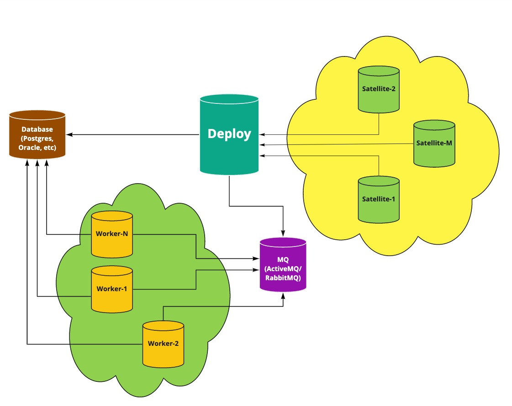

# Architecture

There are 3 ways how your can install Deploy

What kind of setup going to be chosen, depends on the filled in configuration fields.  

By default, it checks the Nexus in location: `com.xebialabs.deployit:xl-deploy-base:${server.version}:server@zip`. 
You have to keep it there in your private Nexus in order the plugin could pull it.

Runtime directory is used when you want to run Deploy for a specific folder and can attach on the fly your java modules
with help of Gradle (can be useful in case of adding some test or mocking modules). It can be enabled by providing the 
value for the field `runtimeDirectory` in servers section.   

Docker based installation is going to happen if to fill in the field `dockerImage` in servers section.   

The richest setup available now you can configure with help of **Integration Server** is depicted below.

