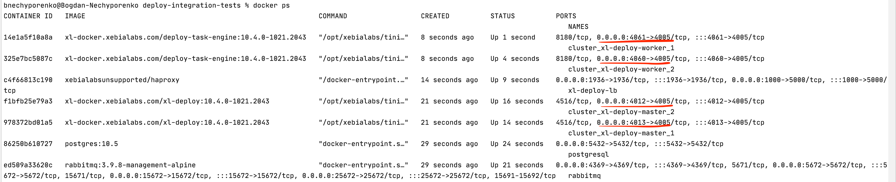

# Configuration

## The first section level

```groovy title=build.gradle
releaseIntegrationServer {
    cluster {}
    clusterProfiles {}
    operatorServer {}
    servers {}
}
```

|Name|Description|
| :---: | :---: |
|     cluster      |                                                  The configuration section for cluster based setup. By default it's disabled.                                                  |
|     clusterProfiles      |                      In this section you can define multiple profiles for different providers and in cluster section define which profile is active now.                       |
| operatorServer |                   Operator is installed/upgraded with help of Deploy server. It can be configured of different image/version that one is running on cluster.                   |
|servers|Server configurations, currently, it's possible to configure only one.|

## Cluster section

```groovy title=build.gradle
releaseIntegrationServer {
    cluster {
        debugSuspend = true
        enable = true
        enableDebug = true
        profile = 'operator'
        publicPort = 1000
    }
}
```

|Name|Type| Default Value |Description|
| :---: | :---: |:-------------:| :---: |
|debugSuspend|Optional|     false     |Suspend the start of the process before the remoting tool is attached. Take in mind that you have to attach to all processes to be able to completely run the cluster.|
|enable|Optional|     false     |If true, cluster setup will be enabled.|
|enableDebug|Optional|     false     |If true, debug will be enabled on all masters and workers. The exposed ports to connect will be randomly defined. You can check with `docker ps` which port was exposed for debugging.|
|profile|Optional|   operator    |The way to run the setup. For now only 1 option is available - 'operator'.
|publicPort|Optional|     8080      |The port to connect to the cluster.|

Example where to check for debugging ports to attach:



Example for operator configuration:

```shell script
    ...
    cluster {
        enable = true
        profile = 'operator'
        publicPort = 10001
    }
    clusterProfiles {
        operator {
            activeProviderName = "aws-openshift"
            awsOpenshift {
                apiServerURL = 'https://yourhost.openshiftapps.com:6443'
                host = 'router-default.yourhost.openshiftapps.com'
                name = 'aws-openshift-test-cluster'
                oauthHostName = "oauth-openshift.yourhost.openshiftapps.com"
                operatorImage = 'acierto/release-operator:1.0.6-openshift'
                operatorPackageVersion = "1.0.7"
            }
        }
    }
    ...
```

## Cluster profiles for operator

```shell script
clusterProfiles {
    operator {
        activeProviderName = "aws-openshift"
        awsOpenshift {
            apiServerURL = 'https://api.acierto.lnfl.p1.openshiftapps.com:6443'
            host = 'router-default.apps.acierto.lnfl.p1.openshiftapps.com'
            name = 'aws-openshift-test-cluster'
            oauthHostName = "oauth-openshift.apps.acierto.lnfl.p1.openshiftapps.com"
            operatorImage = 'acierto/release-operator:1.0.6-openshift'
            operatorPackageVersion = "1.0.1"
        }
        azureAks {
            clusterNodeCount = 3
            clusterNodeVmSize = 'Standard_DS2_v2'
            kubernetesVersion = '1.20'
            location = 'northcentralus'
            name = 'azure-aks-test-cluster'
            skipExisting = false
            azUsername = 'azure_username'
            azPassword = 'secret'
        }
        gcpGke {
            accountCredFile = 'path_to_the_cred_json_file'
            accountName = 'gcp-gke-usert@apollo-playground.iam.gserviceaccount.com'
            clusterNodeCount = 3
            clusterNodeVmSize = 'e2-standard-2'
            kubernetesVersion = '1.20.11-gke.1801'
            name = 'gcp-gke-test-cluster'
            projectName = 'apollo-playground'
            regionZone = 'us-central1-a'
            skipExisting = false
        }        
        onPremise {
            name = 'onprem-test-cluster'
            clusterNodeCpus = 4
            clusterNodeMemory = 15000
            kubernetesVersion = '1.20.0'
            skipExisting = false
        }
        awsEks {
            region = "us-east-1"
            stack = "release-operator-test"
            clusterName = "release-operator-cluster-test"
            nodeGroupName = "release-operator-cluster-nodegroup"
            clusterNodeCount = 2
            sshKeyName = "release-operator-ssh-key"
            fileSystemName = "release-operator-efs-test"
            kubernetesVersion = "1.20"
            skipExisting = true
            stackTimeoutSeconds = 1500000
            stackSleepTimeBeforeRetrySeconds = 300000
            route53InsycAwaitTimeoutSeconds = 300000
            accessKey = "AWS access key"
            secretKey = "AWS Secret key"
        }
    }
}
```

## Servers section

```groovy title=build.gradle
releaseIntegrationServer {
   servers {
       controlPlane { // The name of the section, you can name it as you wish
           dockerImage = "xebialabs/xl-release" 
           httpPort = 5516
           pingRetrySleepTime = 5
           pingTotalTries = 120
           version = '10.2.2'
       }       
   }   
}
```

|Name|Type|Default Value|                                                                                              Description                                                                                              |
| :---: | :---: | :---: |:-----------------------------------------------------------------------------------------------------------------------------------------------------------------------------------------------------:|
|dockerImage|Optional|None| When this property is specified, docker based setup will be performed. The name of the docker image, without version. Version is specified in the separate field or dedicated from gradle properties. |
|httpPort|Optional|Random port|                                                                                   The HTTP port for Release server.                                                                                   |
|pingRetrySleepTime|Optional|10|                            During the startup of the server we check when it's completely booted. This property configures how long to sleep (in seconds) between retries.                            |
|pingTotalTries|Optional|60|                                       During the startup of the server we check when it's completely booted. This property configures how many times to retry.                                        |
|version|Optional|None|                      It can be specified in several ways. Or as a gradle property `xlReleaseVersion`, via parameter or in `gradle.properties` file or explicitly via this field.                      |

### AWS Openshift profile

`activeProviderName = "aws-openshift"`

|Name|Type|               Default Value                |                                                                          Description                                                                           |
| :---: | :---: |:------------------------------------------:|:--------------------------------------------------------------------------------------------------------------------------------------------------------------:|
|apiServerURL|Mandatory|                     -                      |                                                          The URL to your OpenShift cluster server API                                                          |
|host|Mandatory|                     -                      |                        The public host on which cluster will be available to interact with. Basically it is your OpenShift router URL.                         |
|keystorePassphrase|Optional|                  test123                   |                                                   Keystore password to encrypt sensitive information in CIs                                                    |
|name|Mandatory|                     -                      |                                                                   The name of your cluster.                                                                    |
|operatorImage|Optional| xebialabs/release-operator:1.2.0-openshift |                                         The image of operator which is going to be used to install the Reploy cluster                                          |
|operatorPackageVersion|Optional|                   1.0.0                    |                        We deploy operator with help of Release, this is a version which will be used as a application package version.                         |
|oauthHostName|Mandatory|                     -                      | OAuth host name of your OpenShift cluster. It is used to get a new token based on your credentials. This token is required to interact with OpenShift cluster. |
|repositoryKeystore|Optional|                  Provided                  |                                                        Keystore to encrypt sensitive information in CIs                                                        |
|storageClass|Optional|                  aws-efs                   |                           You can use another storage class, but you have to be sure that it is NFS based, otherwise it won't work.                            |

### Azure AKS profile

`activeProviderName = "azure-aks"`

|          Name          |   Type    |             Default Value             |                                                  Description                                                   |
|:----------------------:|:---------:|:-------------------------------------:|:--------------------------------------------------------------------------------------------------------------:|
|       azUsername       | Mandatory |                   -                   |                                  Azure username to be used with az cli tool.                                   |
|       azPassword       | Mandatory |                   -                   |                                  Azure password to be used with az cli tool.                                   |
|    clusterNodeCount    | Optional  |                   2                   |                   Number of the nodes that will be created during cluster creation on Azure.                   |
|   clusterNodeVmSize    | Optional  | Standard_DS2_v2 (Azure default value) |                                          Node VM size named on Azure.                                          |
|   kubernetesVersion    | Optional  |     Default Azure version is 1.20     |                      The kubernetes version that will be custom string for each provider.                      |
|        location        | Mandatory |                   -                   |                 The Azure location that represents geo location where cluster will be running.                 |
|          name          | Mandatory |                   -                   |                                           The name of your cluster.                                            |
|     operatorImage      | Optional  |   xebialabs/release-operator:1.2.0    |                 The image of operator which is going to be used to install the Release cluster                 |
| operatorPackageVersion | Optional  |                 1.2.0                 | We deploy operator with help of Deploy, this is a version which will be used as a application package version. |
|      skipExisting      | Optional  |                 true                  |         For some cluster resources there are checks if resources exist, if set to true skip creation.          |
|      storageClass      | Optional  |                   -                   |         Storage class prefix. On Azure with prefix are created new classes for file and disk storage.          |

### GCP GKE profile

`activeProviderName = "gcp-gke"`

|          Name          |   Type    |           Default Value           |                                                  Description                                                   |
|:----------------------:|:---------:|:---------------------------------:|:--------------------------------------------------------------------------------------------------------------:|
|    accountCredFile     | Optional  |                 -                 |                             A file path to read the access token credentials file.                             |
|      accountName       | Mandatory |                 -                 |                            GCP user account that will be used with `gcloud` plugin.                            |
|    clusterNodeCount    | Optional  |                 3                 |                    Number of the nodes that will be created during cluster creation on GCP.                    |
|   clusterNodeVmSize    | Optional  | Medium_DS2_v2 (GCP default value) |                                           Node VM size named on GCP.                                           |
|   kubernetesVersion    | Optional  |         1.20.11-gke.1801          |                      The kubernetes version that will be custom string for each provider.                      |
|          name          | Mandatory |                 -                 |                                           The name of your cluster.                                            |
|     operatorImage      | Optional  | xebialabs/release-operator:1.2.0  |                 The image of operator which is going to be used to install the Release cluster                 |
| operatorPackageVersion | Optional  |               1.2.0               | We deploy operator with help of Deploy, this is a version which will be used as a application package version. |
|      projectName       | Mandatory |                 -                 |                             The GCP project in which GKE cluster will be created.                              |
|       regionZone       | Mandatory |                 -                 |                         The cluster GEO zone where cluster instances will be located.                          |
|      skipExisting      | Optional  |               true                |         For some cluster resources there are checks if resources exist, if set to true skip creation.          |
|      storageClass      | Optional  |             standard              |   You can use another storage class, but you have to be sure that it is NFS based, otherwise it won't work.    |

### Onprem Minikube profile

`activeProviderName = "onprem"`

|          Name          |   Type    |          Default Value           |                                                  Description                                                   |
|:----------------------:|:---------:|:--------------------------------:|:--------------------------------------------------------------------------------------------------------------:|
|    clusterNodeCpus     | Optional  |                -                 |                                  Number of CPUs that will be used by cluster.                                  |
|   clusterNodeMemory    | Optional  |                -                 |                                Memory size in MB that will be used by cluster.                                 |
|   kubernetesVersion    | Optional  |              1.20.0              |                      The kubernetes version that will be custom string for each provider.                      |
|          name          | Mandatory |                -                 |                                           The name of your cluster.                                            |
|     operatorImage      | Optional  | xebialabs/release-operator:1.2.0 |                 The image of operator which is going to be used to install the Release cluster                 |
| operatorPackageVersion | Optional  |              1.2.0               | We deploy operator with help of Deploy, this is a version which will be used as a application package version. |
|      skipExisting      | Optional  |               true               |         For some cluster resources there are checks if resources exist, if set to true skip creation.          |
|      storageClass      | Optional  |             standard             |   You can use another storage class, but you have to be sure that it is NFS based, otherwise it won't work.    |


### AWS EKS profile

`activeProviderName = "aws-eks"`

|          Name          |   Type    |            Default Value            |                                                  Description                                                   |
|:----------------------:|:---------:|:-----------------------------------:|:--------------------------------------------------------------------------------------------------------------:|
|       accessKey        | Optional |                  -                  |                                     AWS AccessKey to access aws cli tool.                                      |
|       secretKey        | Optional |                  -                  |                                     AWS SecretKey to access aws cli tool.                                      |
|       region           | Optional |             'us-east-1'             |                                    Region where the cluster to be created.                                     |
|       stack            | Optional |       'release-operator-test'       |                                             Name of the AWS stack.                                             | 
|    clusterName         | Optional |   'release-operator-cluster-test'    |                                          Name of the AWS EKS Cluster.                                          |
|   nodeGroupName        | Optional | 'release-operator-cluster-nodegroup' |                      Name of the nodeGroup. At present only two node groups are support.                       |
|   clusterNodeCount     | Optional |                  2                  |         Number of the worker nodes to be created within node group, max node count of each group is 8.         |
|   kubernetesVersion    | Optional |       Default version is 1.20       |                      The kubernetes version that will be custom string for each provider.                      |
|   sshKeyName           | Optional |      'release-operator-ssh-key'      |                                   ssh key for accessing Amazon EC2 instance.                                   |
|   fileSystemName       | Optional |     'release-operator-efs-test'      |                                           AWS EFS file system name.                                            |
|     operatorImage      | Optional |   xebialabs/release-operator:1.2.0   |                 The image of operator which is going to be used to install the Release cluster                 |
| operatorPackageVersion | Optional |                1.2.0                | We deploy operator with help of Deploy, this is a version which will be used as a application package version. |
|      skipExisting      | Optional |                true                 |         For some cluster resources there are checks if resources exist, if set to true skip creation.          |
| stackTimeoutSeconds    | Optional |               1500000               |                     Maximum wait time for 'Stack Creation' or 'Stack Deletion' in seconds.                     |
| stackSleepTimeBeforeRetrySeconds| Optional|               300000                |                      Polling period in seconds for 'Stack Creation' or 'Stack Deletion'.                       |
| route53InsycAwaitTimeoutSeconds| Optional |               300000                |                              Polling period in seconds for route53 provisioning.                               | 
|      storageClass      | Optional |          "aws-efs && gp2'           |       Use gp2 storageclass for postgres and rabbitmq and  use 'aws-efs' storageclass for xl-release pods       |
                                                                                                                                         
### Operator server section

|Name|   Type   |Default Value|                                                                   Description                                                                   |
| :---: |:--------:| :---: |:-----------------------------------------------------------------------------------------------------------------------------------------------:|
|dockerImage| Required |None|                                         It has to be specified explicitly. Example: xebialabs/xl-deploy                                         |
|httpPort| Optional |Random port|               Public http port for Deploy server. Can be useful in case of troubleshooting of the failed deployment of operator.                |
|pingRetrySleepTime| Optional |10| During the startup of the server we check when it's completely booted. This property configures how long to sleep (in seconds) between retries. |
|pingTotalTries| Optional |60|            During the startup of the server we check when it's completely booted. This property configures how many times to retry.             |
|version| Required |None|                                                       It has to be specified explicitly.                                                        |
